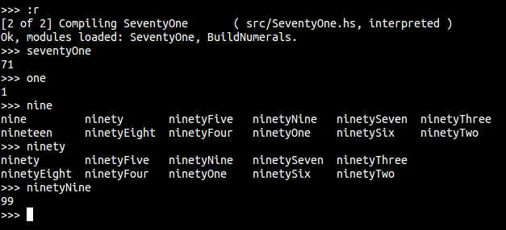

# seventy-one

The number 71 (and 1...and 2...through 99) in *Haskell*

WITH TYPE-SAFETY...

*and no manual definitions of the numbers!*

## Usage

``` haskell
import SeventyOne

businessLogic :: Integer
businessLogic customerCount =
  customerCount + seventyOne
```

## Screenshot



## License

Copyright © 2015 Gary Fredericks, Chris Allen

Distributed under the Eclipse Public License either version 1.0 or (at
your option) any later version.
